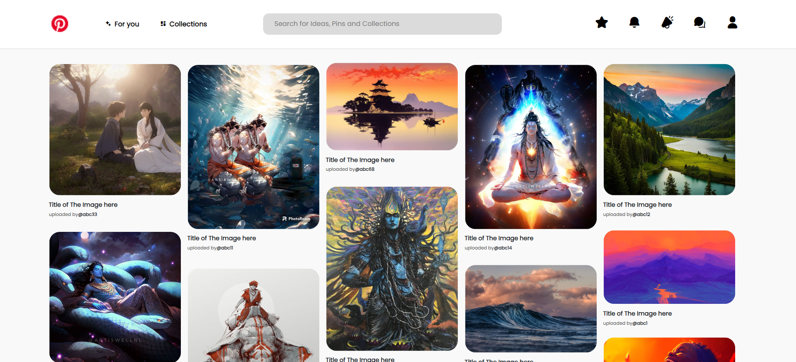
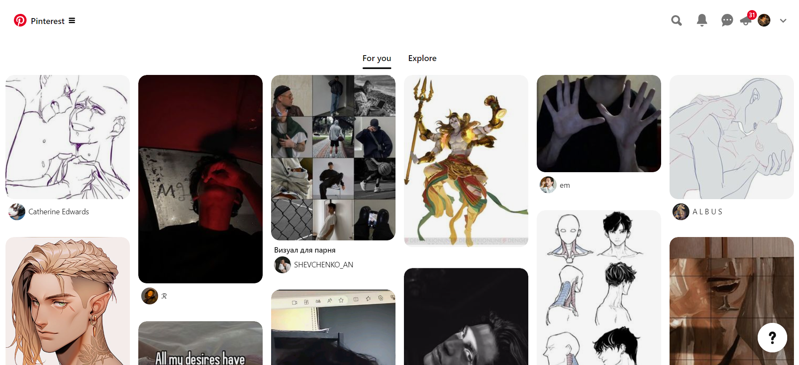

# Pinterest UI Redesign

This project started in year 2018 as a fun project, while I was learning web development, I built the Pinterest UI Clone and posted it on a Facebook group, many said it was just a screenshot of the website from back then, but some recognised. The Issue with the code back then was that the grids were solid and I had recently started prograing for web.

cutting to year 2024, I've recently left my job for taking time and healing myself and while doing that, i was going through my github account when i came across this project again, I decided to update the UI again, but this time around making some changes and not completely copying the UI, you can say more or less it is a redesign of the pinterest webApp.

  
<i>Here's the screenshot, showing how it looks when deployed</i>

<i>At the time of upload, this is how Pinterest WebApp looks</i>
